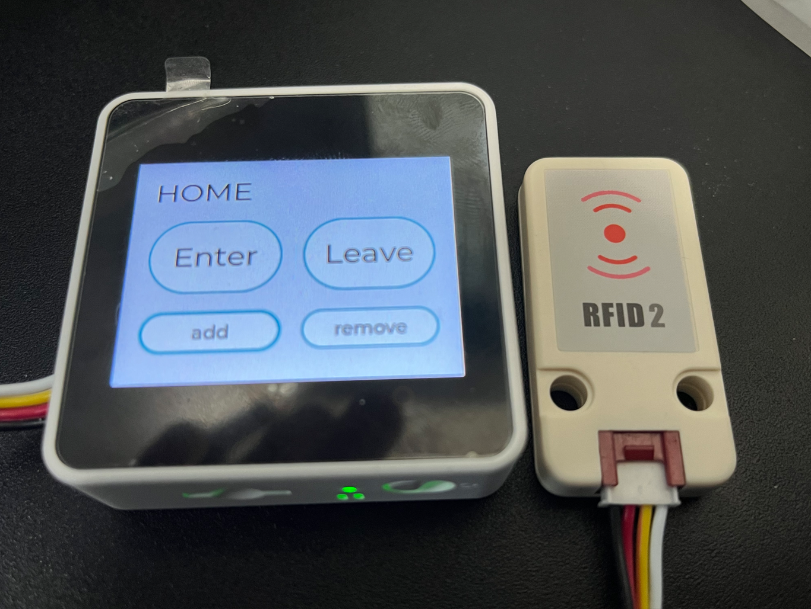
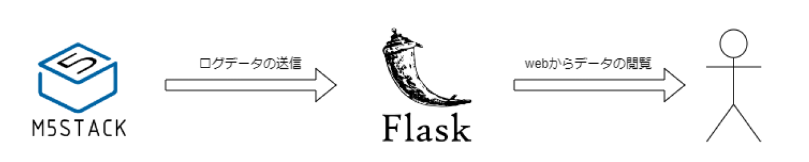

# RFIDタグを認識するセンサを用いて人の出入りを検知するシステム
本プログラムは、M5StackとRFIDタグを認識するセンサを用いて人の出入りを検知するシステムである。<br>
本システムは、Flaskを用いたWebサーバを起動し、Flask側で用意されたAPIを用いてM5Stackが取得した入退出のログなどの情報を送信するようになっている。また、入退出のログなどはWebから閲覧可能である。

# Demo
### ホーム画面


### Demo動画
タグの追加処理<br>


入室処理<br>


退出処理<br>


# Features
## システム概要
Flaskを用いたWebサーバを起動し、Flask側で用意されたAPIを用いてM5Stackが取得した入退出のログなどの情報を送信する。<br>
本システムは、複数のタグがあった場合にもそれぞれを区別し、独立して入退出可能となっている。



## 機能概要
### M5Stack
- タグ追加機能

  本システムは複数のタグがそれぞれ入室することを可能とするために、入室する前にタグをシステムに追加する機能を追加した。

- タグ削除機能

  追加されたタグを削除する機能。

- 入室機能

  タグ追加機能で追加されたタグを検知すると入室が許される。また、すでに入室している場合はエラーが表示される。

- 退出機能

  タグ追加機能で追加されたタグを検知すると退出が許される。また、すでに退出している場合はエラーが表示される。

### Webサーバ

- 提供するAPI
  | APIのURL | 概要 |
  | ---- | ---- |
  | /api/addTag | タグをデータベースに追加する。 |
  | /api/removeTag | タグをデータベースから削除する。 |
  | /api/enter | タグを入室させ、ログを記録する。 |
  | /api/leave | タグを退出させ、ログを記録する。 |

- Webからの閲覧機能
  | URL | 概要 |
  | ---- | ---- |
  | / | タグの情報を閲覧できる。 |
  | /log | 入退出のログを閲覧できる。 |

# Requirement
### M5Stack
  - UIFlow
  - MicroPython
  - FRID Unit2
 
### Webサーバ
  - Python
  - Flask
  - Bootstrap
  - plotly
  - SQLite

# Usage
## server側の起動
1. サーバのディレクトリへ移動<br>
    ```
    cd server
    ```

2. 仮想環境の構築<br>
    ```
    $ python -m venv venv
    $ venv ./venv/Scripts/activate
    ```

2. モジュールのインストール<br>
    ```
    pip install -r requirements.txt
    ```

3. データベースの準備<br>
    ※データベースがinstance配下にすでにある場合は対応不可
    ```
    $ python
    >>> from server import app
    >>> from server import db
    >>> with app.app_context():
    ...    db.create_all()
    >>> exit()

    ```
4. サーバの起動<br>
    ```
    python server.py
    ```

# Note
ファイル構成
```
RFIDRoomSystem<br>
├─m5stack： M5Stack関連のソースコードを格納
└─server： Webサーバ関連のソースコードを格納
    └─instance
        └─db.sqlite3： 取得したログやタグの情報を保持
```